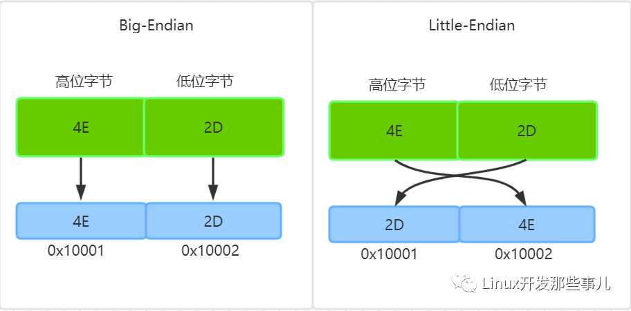
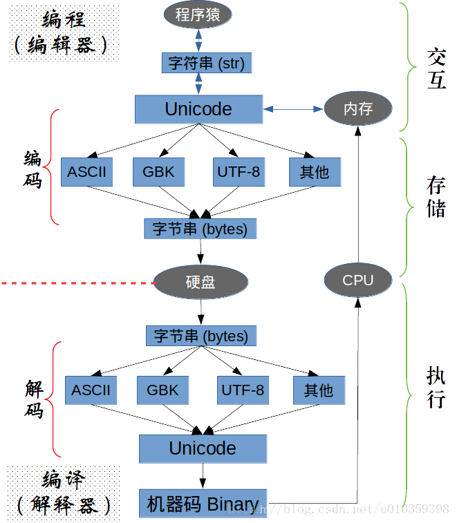

# 文字編碼（ASCII / Unicode / UTF-8 / BOM）

> 從 bit 到字元的對應關係，以及 UTF-8、UTF-16、UTF-32 的差異、位元組順序與 BOM。最後整理 Big5 轉 UTF-8 時的亂碼問題。

## 目錄

- [📖 基本概念](#basic)
- [🔤 ASCII 與擴充 ASCII](#ascii)
- [🌏 Unicode](#unicode)
- [8️⃣ UTF-8](#utf8)
- [1️⃣6️⃣ UTF-16](#utf16)
- [3️⃣2️⃣ UTF-32](#utf32)
- [↔️ 位元組順序 BE / LE](#endian)
- [🏷️ BOM 位元組順序標記](#bom)
- [🔄 文字編解碼流程](#flow)
- [📊 各編碼佔用空間比較](#size)
- [💻 C# 實務問題](#csharp)
- [⚠️ Big5 轉 UTF-8 的亂碼問題](#big5)
- [📚 參考資料](#ref)

---

<a id="basic"></a>

## 📖 基本概念

| 名詞 | 說明 |
|------|------|
| bit（位元） | 電腦內部以二進位表示，每個 bit 有 0 與 1 兩種狀態 |
| byte（位元組 / 字節） | 8 個 bit 為 1 byte，例如 `10111000`，是計量儲存容量的單位 |
| character（字元 / 字符） | 一個資訊單位，例如 `A`、`新` |
| 編碼 encode | 把字元轉換成二進位碼儲存起來 |
| 解碼 decode | 把二進位碼還原成螢幕上有意義的字元 |
| 字符集 character set | 字元與整數一一對應的對映表，例如 ASCII、Unicode |

> 字符集與編碼常被混為一談。**字符集只是字元的集合**（規定哪個字對應哪個號碼），**編碼則是把那個號碼寫成位元組的規則**。Unicode 是字符集，UTF-8 才是編碼方式。

---

<a id="ascii"></a>

## 🔤 ASCII 與擴充 ASCII

### ASCII

- 1 byte 有 8 個 bit，理論上可表示 256 種狀態（`00000000` 到 `11111111`）。
- ASCII 只用了其中 128 種（`00000000` 到 `01111111`，最高位固定為 0），涵蓋英文字母、數字、標點與控制字元。
- 英語用 128 個字元就夠了。

常見範圍：

| 十進位 | 字元 |
|:------:|------|
| 0 ~ 31 | 控制字元（`\n` = 10、`\r` = 13） |
| 32 | 空白 |
| 48 ~ 57 | `0` ~ `9` |
| 65 ~ 90 | `A` ~ `Z` |
| 97 ~ 122 | `a` ~ `z` |

### 擴充 ASCII

- 歐洲語言 128 個字元不夠用，於是把最高位也拿來使用，擴充到 256 個符號（`00000000` 到 `11111111`）。
- 例如法語的 `é` 編碼為 130（二進位 `10000010`）。

問題來了：

- 不同國家用同一段 128 ~ 255 表示各自的字母，**同一個號碼在不同國家代表不同的字**。0 ~ 127 的部分則各家一致。
- 亞洲文字更多，光漢字就約 10 萬個。簡體中文常見的 GB2312 用 2 個 byte 表示一個漢字，理論上最多 256 × 256 = 65536 個符號。

一個 byte 只能表示 256 種符號顯然不夠，必須用多個 byte 表達一個符號，這促成了 Unicode 的出現。

---

<a id="unicode"></a>

## 🌏 Unicode

Unicode（統一碼）整理並編碼了世界上大部分的文字系統，**為所有字元分配一個唯一的數字編號**。

- Unicode **只是一個符號集**，規定了每個符號對應的號碼，但沒有規定這個號碼該怎麼儲存。
- 相容 ASCII，0 ~ 127 的意義不變。

### 碼點 code point

表示形式為 `U+[XX]XXXX`，X 是一個十六進位數字，一般 4 到 6 位，不足 4 位前面補 0。

| 字元 | 碼點 |
|:----:|:------:|
| 新 | U+65B0 |
| 穎 | U+7A4E |
| 严 | U+4E25 |
| 인 | U+C778 |

範圍是 `U+0000` ~ `U+10FFFF`，約 111 萬個。官方表示不再擴充，目前只定義了 11 萬多個字元。

以「新」為例：

```text
碼點     U+65B0
十六進位  65B0
二進位    01100101 10110000    → 需要 2 個 byte
```

隨著字元增加，有些符號需要 3 個或 4 個 byte。

### 為什麼還需要 UTF-x

有了碼點還不夠，直接存碼點會有兩個問題：

1. **邊界問題**：拿到兩個 byte，電腦怎麼知道這是一個漢字，還是兩個英文字母？
2. **空間問題**：如果規定一律用 2 個 byte，英文字元前面那個 byte 永遠是 0，浪費空間。

於是出現了 Unicode 的多種儲存方式，也就是 UTF-8、UTF-16、UTF-32。Unicode 有很長一段時間無法推廣，直到網際網路出現。

---

<a id="utf8"></a>

## 8️⃣ UTF-8

UTF-8（8-bit Unicode Transformation Format）是針對 Unicode 的**可變長度**字元編碼，用 1 ~ 4 個 byte 表示一個符號。

- 網際網路普及後最廣泛使用的 Unicode 實作方式，UTF-16 與 UTF-32 在網路上基本不用。
- 相容 ASCII，0 ~ 127 的編碼與 ASCII 完全相同。
- 2003 年 11 月由 RFC 3629 重新規範，範圍限縮為 `U+0000` ~ `U+10FFFF`，最多 4 個 byte。

### 編碼規則

1. **單 byte 符號**：第一位設為 0，後面 7 位是該符號的碼點。所以英文字母的 UTF-8 與 ASCII 相同。
2. **n byte 符號（n > 1）**：第一個 byte 的前 n 位都設為 1，第 n+1 位設為 0；後續每個 byte 的前兩位一律設為 `10`。剩下的位元填入碼點。

| 碼點（十六進位） | 碼點（十進位） | UTF-8 編碼（二進位） | byte 數 |
|------------------|----------------|----------------------|:-------:|
| `0000 0000` ~ `0000 007F` | 0 ~ 127 | `0xxxxxxx` | 1 |
| `0000 0080` ~ `0000 07FF` | 128 ~ 2047 | `110xxxxx 10xxxxxx` | 2 |
| `0000 0800` ~ `0000 FFFF` | 2048 ~ 65535 | `1110xxxx 10xxxxxx 10xxxxxx` | 3 |
| `0001 0000` ~ `0010 FFFF` | 65536 ~ 1114111 | `11110xxx 10xxxxxx 10xxxxxx 10xxxxxx` | 4 |

### 範例：「严」

```text
碼點      U+4E25
二進位    100 111000 100101          （15 位）

落在 0000 0800 ~ 0000 FFFF，需要 3 個 byte
格式      1110xxxx 10xxxxxx 10xxxxxx

從最後一位往前填入 x，不足的前面補 0
結果      11100100 10111000 10100101
十六進位  E4 B8 A5
```

> 從第一個 byte 就能看出這個字元佔幾個 byte，而且後續 byte 都以 `10` 開頭，不會和首 byte 混淆。這就是 UTF-8 解決邊界問題的方式。

---

<a id="utf16"></a>

## 1️⃣6️⃣ UTF-16

UTF-16 也是可變長度編碼，但只有 2 byte 或 4 byte 兩種長度。

| 碼點（十六進位） | 碼點（十進位） | UTF-16 編碼（二進位） | byte 數 |
|------------------|----------------|-----------------------|:-------:|
| `0000 0000` ~ `0000 FFFF` | 0 ~ 65535 | `xxxxxxxx xxxxxxxx` | 2 |
| `0001 0000` ~ `0010 FFFF` | 65536 ~ 1114111 | `110110yy yyyyyyyy 110111xx xxxxxxxx` | 4 |

**基本多文種平面**（BMP，`U+0000` ~ `U+FFFF`）的字元直接用 2 byte 存碼點。超出的字元用 4 byte 的**代理對**（surrogate pair）：

```text
1. 碼點先減去 0x10000，得到 20 位的值
2. 高 10 位填入高位代理 110110yyyyyyyyyy  （U+D800 ~ U+DBFF）
3. 低 10 位填入低位代理 110111xxxxxxxxxx  （U+DC00 ~ U+DFFF）
```

> 原筆記的表格沒有提到要先減 `0x10000`，直接填入會算錯。`U+D800` ~ `U+DFFF` 這段在 Unicode 中保留給代理對使用，不對應任何字元。

---

<a id="utf32"></a>

## 3️⃣2️⃣ UTF-32

固定長度編碼，**每個字元一律佔 4 byte**，足以容納所有 Unicode 字元，直接存碼點即可，不需要任何轉換。浪費空間，但存取效率高（可直接用索引定位第 n 個字元）。

字元 `A` 的碼點是 `U+0041`：

```text
00000000 00000000 00000000 01000001
```

### 三者如何互相轉換

UTF-8、UTF-16、UTF-32 是同一組碼點的不同二進位表示法。從任一種編碼的二進位可以還原出碼點，有了碼點就能依規則轉成另一種編碼。

---

<a id="endian"></a>

## ↔️ 位元組順序 BE / LE

**只有最小編碼單元超過 1 byte 才會有位元組順序問題。**

| 編碼 | 最小編碼單元 | 有位元組順序問題 |
|------|:------------:|:----------------:|
| UTF-8 | 1 byte | 否 |
| UTF-16 | 2 byte | 是 |
| UTF-32 | 4 byte | 是 |

| 順序 | 縮寫 | 說明 |
|------|:----:|------|
| 大尾序 | BE（Big-Endian） | 高位 byte 在前，存在記憶體低位址端 |
| 小尾序 | LE（Little-Endian） | 低位 byte 在前，存在記憶體低位址端 |

以「中」（`U+4E2D`）在 UTF-16 下為例：

| 順序 | 記憶體中的位元組 |
|------|------------------|
| BE | `4E 2D` |
| LE | `2D 4E` |



大尾序把高位位元組 `4E` 放在低位址 `0x10001`；小尾序則把低位位元組 `2D` 放在低位址，順序顛倒過來。

解析 UTF-16 之前必須先知道是哪一種順序，否則會讀成完全不同的字。

---

<a id="bom"></a>

## 🏷️ BOM 位元組順序標記

BOM 是 **byte-order mark** 的縮寫，用來標示檔案的編碼與位元組順序。

Unicode 中有一個「零寬度非換行空格」（Zero Width No-Break Space）字元 `U+FEFF`，放在檔案開頭當作標記：

- **UTF-16**：開頭是 `FE FF` 表示大尾序，`FF FE` 表示小尾序。
- **UTF-8**：沒有位元組順序問題，開頭的 `EF BB BF` 只是用來標示「這是 UTF-8 檔案」，與順序無關。

| UTF 編碼 | 檔頭標記 |
|----------|----------|
| UTF-8 | `EF BB BF` |
| UTF-16LE | `FF FE` |
| UTF-16BE | `FE FF` |
| UTF-32LE | `FF FE 00 00` |
| UTF-32BE | `00 00 FE FF` |

同樣是「中」（`U+4E2D`），加上 BOM 後檔案的實際內容：

| 編碼 | 檔案位元組 |
|------|------------|
| 碼點 | `0x4E2D` |
| UTF-8 | `EF BB BF` + `E4 B8 AD` |
| UTF-16LE | `FF FE` + `2D 4E` |
| UTF-16BE | `FE FF` + `4E 2D` |
| UTF-32LE | `FF FE 00 00` + `2D 4E 00 00` |
| UTF-32BE | `00 00 FE FF` + `00 00 4E 2D` |

> **注意**：UTF-32LE 的 BOM `FF FE 00 00` 前兩個 byte 就是 UTF-16LE 的 BOM。判斷時要先比對較長的標記，否則會把 UTF-32LE 誤判成 UTF-16LE。

> UTF-8 是否要加 BOM 常有爭議。Unix 工具、shell script 與許多程式語言的原始碼不預期看到 BOM，會把它當成內容的一部分而出錯，一般建議 **UTF-8 不加 BOM**。換行字元的相關問題見 [Git 換行字元 EOL / CRLF 規範](git-eol.md)。

---

<a id="flow"></a>

## 🔄 文字編解碼流程



程式裡拿到的字串是碼點層級的抽象（圖中的 Unicode），真正要落到硬碟或送上網路時，必須先**編碼**成位元組串；讀回來時再依相同規則**解碼**還原。

| 階段 | 動作 |
|------|------|
| 交互 | 程式操作的是字串物件，存在記憶體中，內部以碼點表示 |
| 儲存 | 編碼：碼點 → 位元組串（ASCII / GBK / UTF-8 ...），寫入硬碟或網路 |
| 執行 | 解碼：位元組串 → 碼點，還原成字串後才能處理 |

**亂碼的成因就是編碼與解碼用了不同的規則。** 例如用 GBK 存檔卻用 UTF-8 開啟，位元組沒變，但拆解方式變了，還原出來的碼點自然不對。後面 [Big5 轉 UTF-8 的亂碼問題](#big5)就是這個情況的實例。

---

<a id="size"></a>

## 📊 各編碼佔用空間比較

單位為 byte：

| 文字 | ASCII | UTF-16 | UTF-8 | UTF-32 | Big5 |
|:-------:|:-----:|:------:|:-----:|:------:|:----:|
| 新 | 無法表示 | 2 | 3 | 4 | 2 |
| i | 1 | 2 | 1 | 4 | 1 |
| 新穎 | 無法表示 | 4 | 6 | 8 | 4 |
| innovue | 7 | 14 | 7 | 28 | 7 |

- **UTF-16**：BMP 內的字元佔 2 byte，超出的佔 4 byte。原筆記寫的「Unicode 編碼都佔 2 byte」指的是 UTF-16，而且只在 BMP 範圍內成立。
- **UTF-8**：可變長度，1 ~ 4 byte。英數字省空間，中文比 UTF-16 多一個 byte。
- **UTF-32**：不論什麼字都佔 4 byte，最浪費空間。
- **UTF-8 與 UTF-16 哪個省空間並不一定**，取決於內容。純中文用 UTF-16 較省，混英數字或純英文則 UTF-8 較省。
- 原筆記表格中「新」的 ASCII 欄寫 1、「新穎」寫 2 是不對的，ASCII 只有 128 個字元，根本無法表示中文。

---

<a id="csharp"></a>

## 💻 C# 實務問題

### 讀取帶 BOM 的 XML

`test.xml` 編碼為 UTF-8 with BOM，內容開頭是 `EF BB BF 3C 72 3E 0D 0A ...`：

```csharp
var filePath = @"test.xml";

// 方法一，成功
XElement.Load(filePath);

// 方法二，成功
XElement.Parse(File.ReadAllText(filePath));

// 方法三，失敗
var xmlBytes = File.ReadAllBytes(filePath);
XElement.Parse(Encoding.UTF8.GetString(xmlBytes));
```

原因：

| 方法 | 是否處理 BOM |
|------|--------------|
| `XElement.Load` | 內部用 `XmlReader.Create`，會處理 BOM |
| `File.ReadAllText` | 內部用 `StreamReader(path, encoding, detectEncodingFromByteOrderMarks: true, ...)`，會偵測並去掉 BOM |
| `File.ReadAllBytes` | 原始位元組，**不處理 BOM**，`EF BB BF` 會被當成內容，解析 XML 時就會失敗 |

> 自己讀 byte 再轉字串時要記得處理 BOM，或改用 `File.ReadAllText`。

### 模擬用錯誤編碼開啟檔案

相當於用 UTF-8 的文字編輯器去開啟 UTF-16 的檔案：

```csharp
var text = "的";
var unicodeBytes = Encoding.Unicode.GetBytes(text);
Encoding.UTF8.GetString(unicodeBytes);

// 輸出：�v
```

相當於用文字編輯器選擇 UTF-8 編碼另存新檔（正確轉換）：

```csharp
var text = "的";
var unicodeBytes = Encoding.Unicode.GetBytes(text);
var utf8Bytes = Encoding.Convert(Encoding.Unicode, Encoding.UTF8, unicodeBytes);
Encoding.UTF8.GetString(utf8Bytes);

// 輸出：的
```

差別在於 `Encoding.Convert` 有真的做位元組層級的轉換，而前者只是拿 UTF-16 的位元組硬套 UTF-8 的規則去解讀。

---

<a id="big5"></a>

## ⚠️ Big5 轉 UTF-8 的亂碼問題

Big5 的第二個 byte 可能落在 ASCII 的可見範圍，撞到程式語言的跳脫字元，這是把 Big5 原始碼轉成 UTF-8 時最常見的災難。

以「許」為例：

```text
Big5 十六進位   B3 5C
Big5 二進位     10110011 01011100
```

用 UTF-8 去解讀這兩個 byte：

```text
10110011  → 不符合 UTF-8 任何一種首 byte 格式，無法解析，顯示為 �
01011100  → 0x5C，剛好是 ASCII 的反斜線 \
```

所以「許」在 UTF-8 下顯示成 `�\`：

```csharp
// Big5 原始碼
var word = "許";

// 誤轉成 UTF-8 後
var word = "�\";
```

那個多出來的 `\` 會把後面的引號跳脫掉，導致字串沒有結束，編譯直接報錯。

### Big5 亂碼字整理表

第二個 byte 落在 `0x40` ~ `0x7E` 之間的字，轉碼時要特別注意：

| 使用頻率 | 字 |
|----------|-----|
| 最高 | 許、功、蓋、餐、淚、擺、閱、穀 |
| 次高 | 么、吒、俞、歿、珮、縷、吭、鈾、髏、璞、廄、琵、跚、枯、豹、愧 |
| 極低 | 沔、坼、苒、娉、崤、稞、暝、墦、黠、孀、踊、躡 |
| 幾乎不會用到 | 箤、嫹、潿、蔌、醆、嬞、獦、佢、螏、餤、燡、螰、駹、礒、鎪、瀙、酀、瀵、騱、酅、贕、鱋、鱭、尐、汻、岤、垥、柦、胐、娖、涂、罡、偅、惝、牾、莍、傜、揊、焮、茻、鄃、幋、滜、綅、赨、塿、槙 |

> 轉檔後全域搜尋這些字確認沒有被破壞，特別是註解與字串中的「許」與「功」。

---

<a id="ref"></a>

## 📚 參考資料

- [字符編碼筆記：ASCII，Unicode 和 UTF-8 - 阮一峰](https://www.ruanyifeng.com/blog/2007/10/ascii_unicode_and_utf-8.html)
- [Unicode 官方](https://home.unicode.org/)
- [RFC 3629 - UTF-8](https://datatracker.ietf.org/doc/html/rfc3629)
- [The Absolute Minimum Every Software Developer Must Know About Unicode](https://www.joelonsoftware.com/2003/10/08/the-absolute-minimum-every-software-developer-absolutely-positively-must-know-about-unicode-and-character-sets-no-excuses/)
